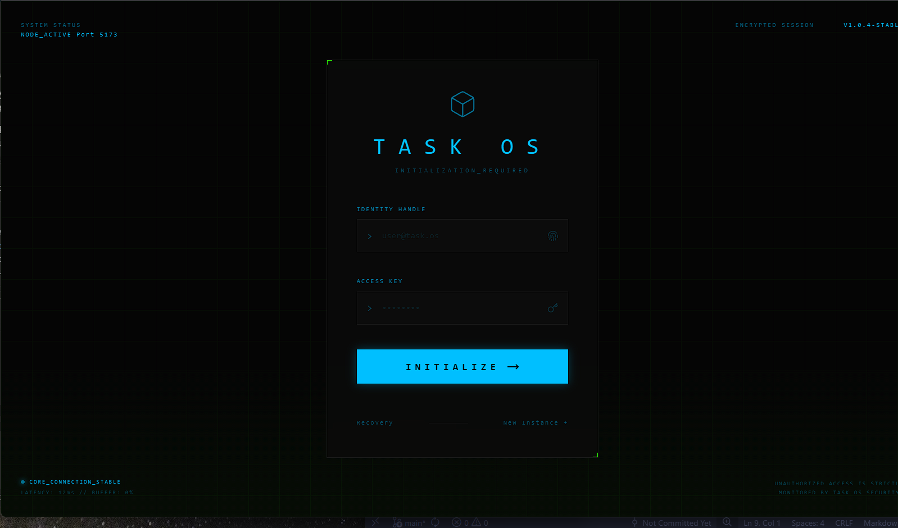
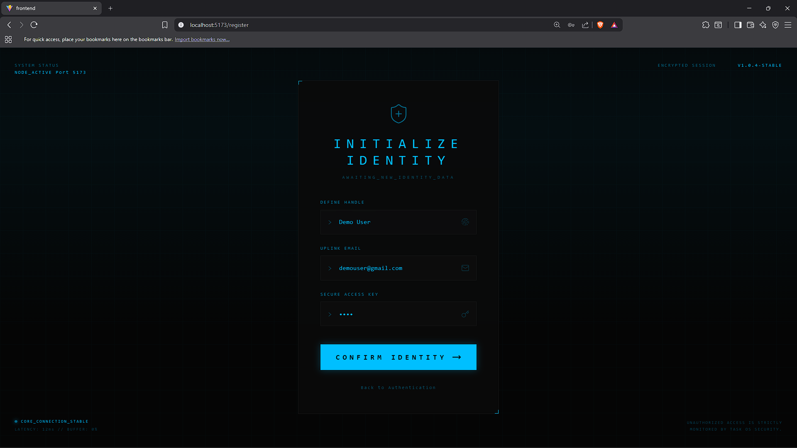
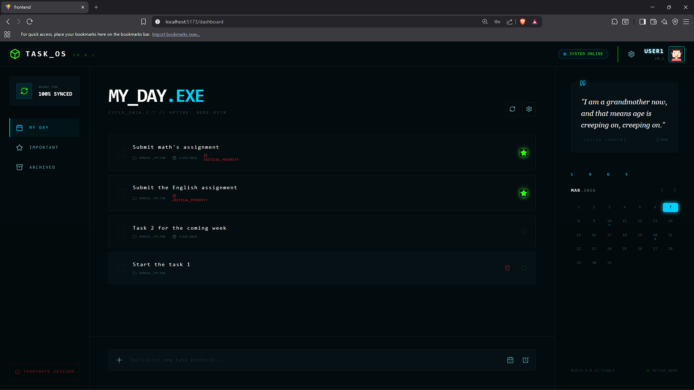

# TASK_OS — Cyberpunk Todo App

A full-stack task management app with a cyberpunk aesthetic, built with React, Node.js, Express, and MongoDB.

## 📸 Screenshots

### Login Page


### Register


### Dashboard


---

## ✨ Features

- 🔐 **Authentication** — Secure login and registration with bcrypt password hashing
- ✅ **Task Management** — Add, edit, delete, and toggle tasks
- ⭐ **Important Tasks** — Star tasks to mark them as critical
- 📅 **Due Dates** — Set termination dates for tasks with a calendar picker
- ⏰ **Reminders** — Set reminder times for tasks
- 📋 **Task Detail Panel** — Click any task to view and edit full details
- 🗓️ **Interactive Calendar** — View tasks by date with dot indicators
- 💬 **Motivational Quotes** — Fetched live from API Ninjas
- 🔔 **Notifications** — Badge count for overdue and due-today tasks
- 🎨 **Cyberpunk UI** — Dark themed terminal-style interface

---

## 🛠️ Tech Stack

### Frontend
- React 18
- React Router DOM
- Axios
- Tailwind CSS
- Lucide React (icons)
- React Day Picker
- Vite

### Backend
- Node.js
- Express.js
- MongoDB + Mongoose
- bcryptjs
- CORS
- dotenv
- Axios

### Deployment
- **Frontend** → Vercel
- **Backend** → Render
- **Database** → MongoDB Atlas

---

## 📁 Project Structure

```
ToDo/
├── backend/
│   ├── models/
│   │   ├── users.js
│   │   └── operations.js
│   ├── .env
│   ├── config.js
│   ├── index.js
│   └── package.json
├── frontend/
│   ├── src/
│   │   ├── components/
│   │   │   ├── ui/
│   │   │   │   ├── TerminalInput.jsx
│   │   │   │   └── TerminalButton.jsx
│   │   │   └── login/
│   │   │       ├── StatusHeader.jsx
│   │   │       └── SystemFooter.jsx
│   │   ├── pages/
│   │   │   ├── LoginPage.jsx
│   │   │   ├── RegisterPage.jsx
│   │   │   └── Dashboard.jsx
│   │   ├── utils/
│   │   │   └── sound.js
│   │   ├── App.jsx
│   │   └── main.jsx
│   ├── .env
│   ├── vercel.json
│   └── package.json
```

---

## ⚙️ Getting Started

### Prerequisites
- Node.js v18+
- MongoDB Atlas account
- API Ninjas account (for quotes)

### 1. Clone the repository

```bash
git clone https://github.com/somyayq/To-Do.git
cd To-Do
```

### 2. Setup Backend

```bash
cd backend
npm install
```

Create a `.env` file in the backend folder:
```
PORT=5555
MONGO_URI=mongodb+srv://<username>:<password>@cluster0.xxxxx.mongodb.net/ToDo?retryWrites=true&w=majority
```

Start the backend:
```bash
npm run dev
```

### 3. Setup Frontend

```bash
cd frontend
npm install
```

Create a `.env` file in the frontend folder:
```
VITE_API_URL=http://localhost:5555
```

Start the frontend:
```bash
npm run dev
```

---

## 🔌 API Routes

| Method | Route | Description |
|--------|-------|-------------|
| POST | `/api/signup` | Register a new user |
| POST | `/api/login` | Login user |
| GET | `/api/operations/:agent_id` | Get all tasks for a user |
| POST | `/api/operations` | Create a new task |
| PATCH | `/api/operations/:id` | Edit a task |
| PATCH | `/api/operations/:id/toggle` | Toggle task completion |
| PATCH | `/api/operations/:id/star` | Toggle task importance |
| DELETE | `/api/operations/:id` | Delete a task |
| GET | `/api/quote` | Fetch motivational quote |

---

## 🌐 Deployment

### Backend (Render)
1. Push code to GitHub
2. Create a new Web Service on Render
3. Set **Root Directory** to `backend`
4. Set **Build Command** to `npm install`
5. Set **Start Command** to `node index.js`
6. Add environment variable: `MONGO_URI`

### Frontend (Vercel)
1. Import GitHub repo on Vercel
2. Set **Root Directory** to `frontend`
3. Add environment variable: `VITE_API_URL` = your Render URL
4. Deploy

---

## 📝 License

This project is open source and available under the [MIT License].

---
